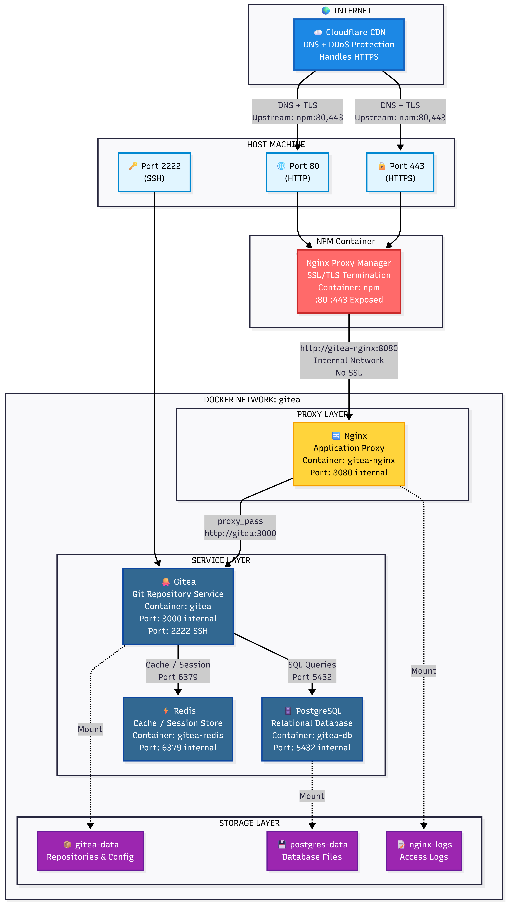
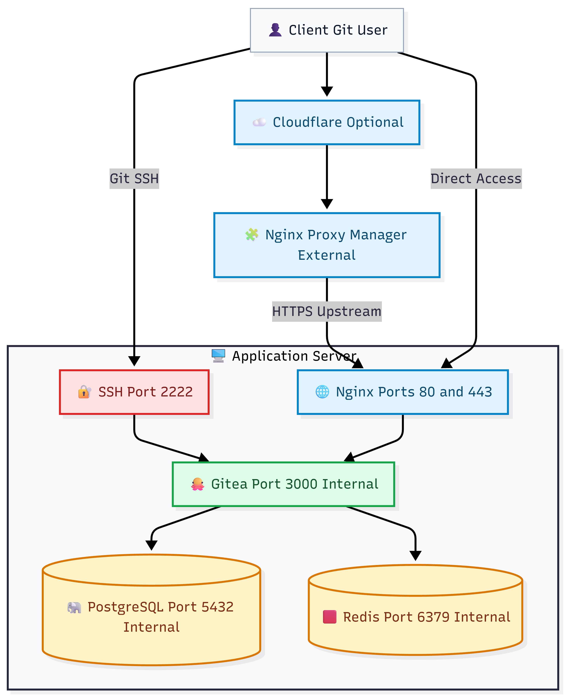

# 🐙 Gitea Stack – Single-Server Docker Deployment

[](LICENSE)
[](https://docs.docker.com/compose/)
[](https://gitea.io)
[](https://www.postgresql.org/)
[](https://nginx.org/)

Production-ready **single-server** Gitea deployment using Docker Compose with **PostgreSQL**, **Redis**, and **Nginx**. If you use **Cloudflare** or **Nginx Proxy Manager (NPM)** on another server, they should simply forward traffic to this server's public Nginx port.

---

## 📋 Quick Links

- **[⚡ Quick Start](#-quick-start)** – Bring the stack up fast
- **[🏗️ Architecture](#-architecture)** – Final topology used by this repo
- **[📚 Documentation](docs/)** – Operational references
- **[🔧 Commands](#-common-commands)** – Day-to-day ops cheat sheet

---

## 🚀 Quick Start

```bash
# 1. Clone repository
git clone https://github.com/your-org/gitea-stack.git /opt/gitea
cd /opt/gitea

# 2. One-shot deploy (recommended)
chmod +x deploy.sh
./deploy.sh
```

Access after startup:

- **Web via Nginx:** `http://SERVER_IP` or `https://git.example.com`
- **Git SSH:** `ssh git@SERVER_IP -p 2222`

### Manual mode (optional)

If you prefer step-by-step setup instead of one-shot script:

```bash
cp .env.example .env
nano .env
docker compose up -d
docker compose ps
```

---

## 🏗️ Architecture

This repository now supports **one official deployment mode only**:

**Topology Type:** Layered Reverse Proxy Topology (Hybrid)  
**Also known as:**
- Layer 1: Cloudflare
- Layer 2: External NPM
- Layer 3: App Proxy (Nginx)
- Application/Data Stack: Gitea + PostgreSQL + Redis

### Topology Diagram (Primary)



### Topology Diagram (Alternate)



### Layer-by-Layer Explanation

1. **Layer 1 — Cloudflare (Optional)**
	- Acts as DNS + edge protection (DDoS/WAF/CDN depending on your plan).
	- Terminates public TLS from internet clients.
	- Forwards traffic to your external reverse proxy (NPM) or directly to this server.

2. **Layer 2 — External NPM (Optional)**
	- Runs on a separate server from this repository stack.
	- Central place for SSL certificate management and virtual host routing.
	- Forwards incoming requests to this app server (`:80` recommended, `:443` optional).

3. **Layer 3 — App Proxy (Nginx in this stack)**
	- Main HTTP/HTTPS gateway inside this deployment.
	- Applies proxy headers, timeouts, and request handling policy.
	- Routes app traffic to Gitea internal service on `gitea:3000`.

4. **Application/Data Stack — Gitea + PostgreSQL + Redis**
	- **Gitea** handles web UI, git smart HTTP, API, and repository operations.
	- **PostgreSQL** stores relational data (users, repos metadata, issues, settings).
	- **Redis** handles cache/session/queue to improve responsiveness and offload DB.

### Request Flow (HTTP/HTTPS)

`Client → Cloudflare (optional) → External NPM (optional) → Nginx → Gitea → PostgreSQL/Redis`

### SSH Flow (Git over SSH)

`Client → Server:2222 → Gitea:22`

This SSH path is independent from HTTP reverse proxy flow, so git clone/push via SSH still works even when web traffic goes through Cloudflare/NPM.

### Why this architecture

- **Separation of concerns:** edge proxy and app stack are clearly separated.
- **Operational flexibility:** can run with or without Cloudflare/NPM.
- **Security posture:** internal services (`3000`, `5432`, `6379`) remain unexposed.
- **Scalability path:** easy to add more apps behind NPM without changing Gitea internals.

### External Proxy Note

If **Cloudflare** and **NPM** live outside this server, that is perfectly fine—and cleaner, honestly. This server only needs to run:

- `nginx`
- `gitea`
- `db`
- `redis`

Then your external reverse proxy can point to:

- **Recommended:** `http://SERVER_IP:80`
- **Optional:** `https://SERVER_IP:443` if you also want TLS termination on this server

### Port Mapping

| Port | Service | Purpose | Exposed |
|------|---------|---------|---------|
| **80** | Nginx | HTTP entrypoint / upstream target | ✅ Yes |
| **443** | Nginx | HTTPS entrypoint | ✅ Yes |
| **2222** | Gitea | Git SSH clone/push/pull | ✅ Yes |
| 3000 | Gitea | Internal HTTP only | ❌ No |
| 5432 | PostgreSQL | Internal database | ❌ No |
| 6379 | Redis | Internal cache/session | ❌ No |

---

## 📚 Documentation

- **[QUICK-REFERENCE.md](docs/QUICK-REFERENCE.md)** – Common commands and verification steps
- **[EXTERNAL-REVERSE-PROXY.md](docs/EXTERNAL-REVERSE-PROXY.md)** – How to place NPM / Cloudflare in front of this server

---

## 📦 Installation

### Prerequisites

- **Docker** 20.10+
- **Docker Compose** 2.0+
- **2GB+ RAM** (4GB+ recommended)
- **10GB+ disk** space
- Open ports: **80**, **443**, and **2222**

### 1. Clone & Prepare

```bash
git clone https://github.com/your-org/gitea-stack.git /opt/gitea
cd /opt/gitea
cp .env.example .env
```

### 2. Generate Secrets

```bash
openssl rand -base64 48   # GITEA_SECRET_KEY
openssl rand -base64 64   # GITEA_INTERNAL_TOKEN
openssl rand -base64 48   # GITEA_JWT_SECRET
openssl rand -base64 24   # POSTGRES_PASSWORD
openssl rand -base64 24   # REDIS_PASSWORD
```

### 3. Configure `.env`

Example:

```env
GITEA_DOMAIN=git.example.com
GITEA_ROOT_URL=https://git.example.com/
GITEA_SSH_DOMAIN=git.example.com
GITEA_SSH_PORT=2222
GITEA_SSH_BIND_IP=0.0.0.0

POSTGRES_DB=gitea
POSTGRES_USER=gitea
POSTGRES_PASSWORD=<strong-password>

REDIS_PASSWORD=<strong-password>

GITEA_SECRET_KEY=<generated-secret>
GITEA_INTERNAL_TOKEN=<generated-secret>
GITEA_JWT_SECRET=<generated-secret>
```

### 4. Prepare SSL (Optional but Recommended)

If this server will terminate HTTPS itself, place certificates in `./ssl/` and update `nginx/gitea.conf` if needed.

### 5. Start the Stack

```bash
docker compose up -d
docker compose ps
docker compose logs -f --tail=50
```

---

## ⚙️ Configuration Notes

### Nginx Behavior

- Nginx is the only HTTP/HTTPS entrypoint in this stack.
- Gitea remains internal on port `3000`.
- PostgreSQL and Redis remain private on the backend network.

### When Using External NPM

Point NPM on the other server to this host:

- **Forward Hostname/IP:** this server IP or DNS name
- **Forward Port:** `80` (recommended) or `443`
- **Websockets:** enabled
- **Preserve Host header:** enabled

More detail: [docs/EXTERNAL-REVERSE-PROXY.md](docs/EXTERNAL-REVERSE-PROXY.md)

---

## 🔧 Common Commands

```bash
# One-shot deploy (create runtime dirs + start stack)
./deploy.sh

# Start / stop / restart
docker compose up -d
docker compose down
docker compose restart

# Status
docker compose ps
docker compose ps --format "table {{.Names}}\t{{.Status}}"

# Logs
docker compose logs -f
docker compose logs -f --tail=50 nginx
docker compose logs -f --tail=50 gitea

# Access containers
docker compose exec gitea sh
docker compose exec db psql -U gitea gitea
docker compose exec redis redis-cli -a "$REDIS_PASSWORD"
```

---

## 🔐 Security Notes

1. Keep `.env` out of Git.
2. Use strong secrets for PostgreSQL, Redis, and Gitea tokens.
3. Restrict inbound access so only expected sources can hit `80`, `443`, and `2222`.
4. If NPM is on another server, allow only that server for HTTP/HTTPS where possible.
5. Keep backups of both `postgres-data/` and `gitea-data/`.

---

## 📁 Project Structure

```text
/opt/gitea/
├── docker-compose.yml              ← Single official deployment file
├── .env                            ← Local secrets (never commit)
├── .env.example                    ← Environment template
├── .gitignore                      ← Sensitive/runtime exclusions
├── README.md                       ← Main documentation
├── IMPLEMENTATION_SUMMARY.md       ← Change summary
│
├── nginx/
│   ├── gitea.conf                  ← Active reverse proxy config
│   ├── proxy_params.inc            ← Shared proxy headers
│   ├── nginx.conf                  ← Base nginx config (if used)
│   └── websocket.inc               ← Websocket helper include
│
├── docs/
│   ├── QUICK-REFERENCE.md
│   └── EXTERNAL-REVERSE-PROXY.md
│
├── gitea-data/
├── postgres-data/
├── log/
├── ssl/
└── backups/
```

---

## 📝 Operational Summary

- This server runs the application stack only.
- External Cloudflare / NPM are allowed, but not managed by this repository.
- There is now **one compose file**, **one Nginx mode**, and much less room for configuration drift. Tiny victory, big sanity gain.

---

**Last Updated:** April 28, 2026
